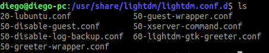

<html lang="es">
<head>
    <meta charset="UTF-8">
    <meta name="description" content="Solución al lag en pantalla en Lubuntu">
    <meta name="keywords" content="lubuntu">
    <meta name="author" content="Juan Diego Mesa Álvarez";
</head>
<body>
<h2>Pasos a seguir para activar el teclado numérico en el arranque de Lubuntu</h2>
<ul>
  <li>Primero, debemos abrir una Terminal.</li>
  <li>Necesitaremos un programa llamado <strong>numlockx</strong>, que nos permitirá activar el teclado numérico 
  en el arranque del sistema. Para ello introduciremos el siguiente comando: <code> sudo apt-get install numlockx </code></li>
  <li>En el siguiente paso utilizaremos el editor de textos "nano". Si no dispones de él, puedes realizarlo con otro editor de 
  texto, como por ejemplo, "vim".</li>
   
   <blockquote>
    
<strong>NOTA:</strong> Comando para instalar el editor de texto "nano": <code>sudo apt-get install nano </code>

   </blockquote>
  
  <li>Nos movemos a la ruta <code> /usr/share/lightdm/lightdm.conf.d/ </code>. Si hacemos un <code>ls</code>, observaremos que 
  hay varios archivos.</li>
  
