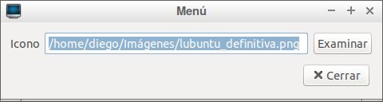

# Icono personalizado de menú 
  
Aquí se presenta un icono de menú alternativo realizado por mí. Cualquiera puede descargarlo y usarlo.
   Imagen de demostración: 
  
   
  

  
El icono se encuentra disponible para su descarga en la carpeta <code>img</code> de este repositorio, o simplemente
  haciendo clic en la imagen.

  
  <h3>¿Cómo lo instalo?<h3>
  
Hacemos clic secundario sobre el botón de Menú. Nos saldrá un menú desplegable. Seleccionaremos la opción "Configuración
    de <<Menú>>. 
    
