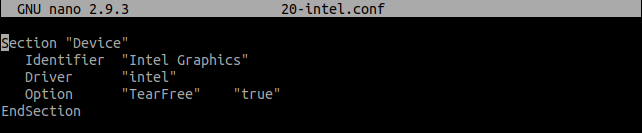

<html lang="es">
<head>
    <meta charset="UTF-8">
    <meta name="description" content="Solución al lag en pantalla en Lubuntu">
    <meta name="keywords" content="lubuntu">
    <meta name="author" content="Juan Diego Mesa Álvarez";
</head>
<body>
<h2>Pasos a seguir para solucionar el lag de pantalla en Lubuntu 16 y posteriores</h2>
<ul>
  <li>Primero, debemos abrir una Terminal</li>
  <li>Acto seguido, escribiremos el siguiente comando: <code> sudo mkdir -p /etc/X11/xorg.conf.d/ </code></li>
  <li>En este paso utilizaremos el editor de textos "nano". Si no dispones de él, puedes realizarlo con otro editor de texto como "vim".</li> 
  <blockquote>
  
<strong>NOTA:</strong> Comando para instalar el editor de texto "nano": <code>sudo apt-get install nano </code>

  </blockquote>
  <li>Procederemos a crear un fichero llamado <b>20-intel.conf</b> con el siguiente comando: <code> sudo nano /etc/X11/xorg.conf.d/20-intel.conf</code>
  . Dicho fichero contendrá una serie de parámetros que ayudarán al sistema a reconocer correctamente la tarjeta gráfica.</li>
  
  <li>Introduciremos dentro la siguiente información:</li> 
    
     
  <li>Guardamos los cambios con CTRL-O, pulsamos la tecla Enter, y salimos con CTRL-X.</li>
  <li>Reiniciamos la máquina con el comando <code>reboot</code>, o simplemente abriendo Menú > Salir > Reiniciar. </li>
 </ul>
</body>
</html>
